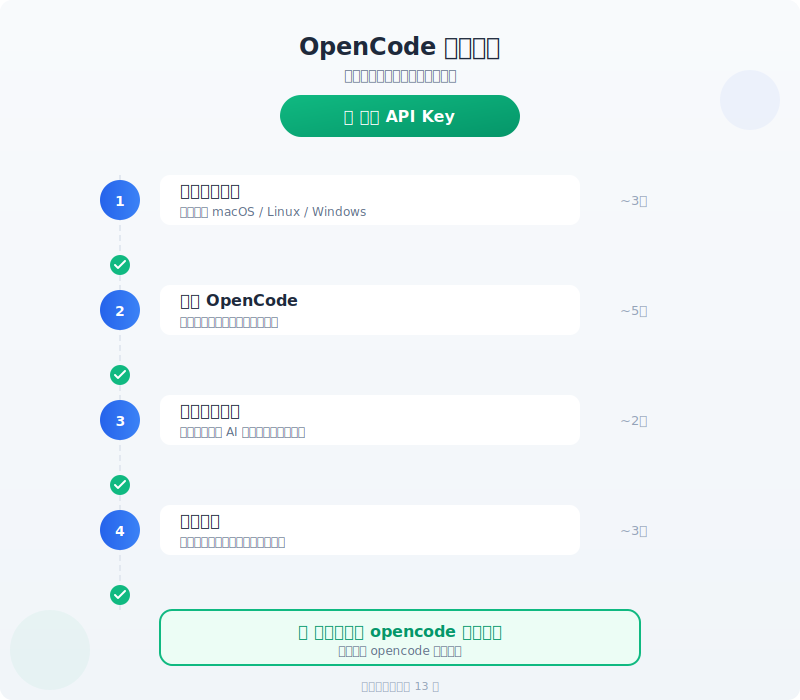
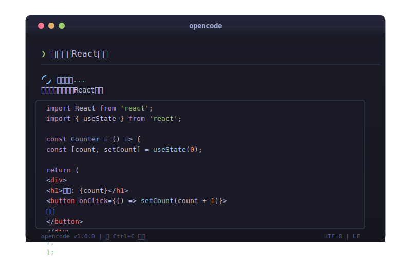

# 🚀 快速开始 - 5 分钟上手 OpenCode

> OpenCode 是一个 AI 编程助手，装完就能用，完全免费。

---

## 第 1 步：安装

**Windows：** 双击 `[Windows] 双击我安装.bat`  
**macOS / Linux：** 打开终端执行：

```bash
chmod +x 脚本/安装.sh
./脚本/安装.sh
```

运行后自动下载安装 OpenCode，几秒就好。



---

## 第 2 步：启动

在终端输入：

```bash
opencode
```

第一次启动会自动加载免费模型，稍等几秒就可以开始用了。



---

## 第 3 步：开始对话

启动后，你会看到一个 `>` 提示符，直接输入你的需求：

```
> 用 Python 写一个计算斐波那契数列的函数
> 帮我创建一个 React 计数器组件
> 解释一下这段代码是做什么的
```

OpenCode 会理解你的需求，生成代码，并自动创建文件。

---

## 第 4 步：切换模型（可选）

如果你想换个模型，在 opencode 中输入：

```
/models
```

会列出所有可用模型，选择带有 `-free` 后缀的免费模型即可：

- `opencode/glm-4.7-free` — 中文能力强
- `opencode/minimax-m2.1-free` — 速度快
- `opencode/kimi-k2.5-free` — 长上下文

---

## 完成！✅

你已经成功配置好了 OpenCode！下面是几个实用技巧：

| 操作 | 说明 |
|------|------|
| `opencode` | 启动 |
| `Ctrl+C` | 中断当前操作 |
| `Ctrl+D` | 退出 |
| `/help` | 查看帮助 |
| `/models` | 切换模型 |

---

## 下一步

- 📖 [安装指南](../02-安装指南/安装指南.md) — 各平台详细安装步骤
- ⚙️ [配置指南](../03-配置指南/配置指南.md) — 了解配置文件
- 🎯 [日常使用](../04-日常使用/日常使用.md) — 高效使用技巧
- 🔧 [常见问题](../05-常见问题/常见问题.md) — 遇到问题看这里
