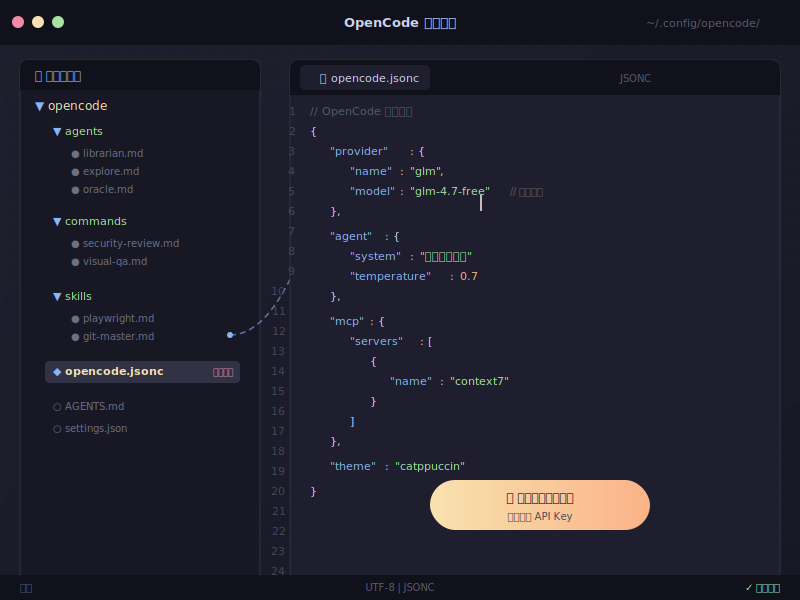

# ⚙️ 配置指南

> OpenCode 默认配置已经可以直接使用。如果你想自己调整，可以看看下面的说明。

---

## 配置文件在哪里

OpenCode 的配置文件在：

| 系统 | 路径 |
|------|------|
| macOS / Linux | `~/.config/opencode/opencode.jsonc` |
| Windows | `%USERPROFILE%\.config\opencode\opencode.jsonc` |



---

## 默认配置

安装脚本会自动生成以下配置，默认使用免费模型：

```jsonc
{
  "$schema": "https://opencode.ai/config.json",
  "plugin": ["oh-my-openagent"],
  "model": "opencode/glm-4.7-free",
  "agent": {
    "explore":  { "model": "opencode/minimax-m2.1-free" },
    "librarian": { "model": "opencode/minimax-m2.1-free" },
    "oracle":   { "model": "opencode/glm-4.7-free" }
  }
}
```

---

## 配置项说明

### `plugin` — 插件
目前推荐启用 `oh-my-openagent` 插件，提供更多实用功能。

### `model` — 默认模型
所有任务默认使用的 AI 模型。

可用的免费模型（在 opencode 里输入 `/models` 查看完整列表）：

| 模型 | 特点 |
|------|------|
| `opencode/glm-4.7-free` | 中文能力强，推荐 |
| `opencode/minimax-m2.1-free` | 速度快，200K 上下文 |
| `opencode/gpt-5-nano` | 轻量快速 |
| `opencode/kimi-k2.5-free` | 256K 超长上下文 |
| `opencode/deepseek-v4-flash-free` | 速度快 |

### `agent` — 不同任务的专用模型

| Agent | 职责 | 建议模型 |
|-------|------|----------|
| `explore` | 搜索代码、查找文件 | 轻量模型（minimax） |
| `librarian` | 查文档、找资料 | 轻量模型 |
| `oracle` | 复杂推理、架构设计 | 最强模型（glm-4.7） |

---

## 切换免费模型

在 opencode 中运行：

```
/models
```

会显示所有可用模型，选择你喜欢的免费模型即可。不需要改配置文件。

---

## 配置付费模型（可选）

如果你有 Claude、OpenAI 等付费账号，可以配置自己的 API Key：

```bash
opencode auth login
```

然后在 opencode.jsonc 中取消注释付费模型配置：

```jsonc
// "model": "claude/claude-sonnet-4-20250514",
// "agent": {
//   "explore":  { "model": "openai/gpt-4o-mini" },
//   "librarian": { "model": "openai/gpt-4o-mini" },
//   "oracle":   { "model": "claude/claude-sonnet-4-20250514" }
// }
```

---

## 下一步

- 🎯 [日常使用](../04-日常使用/日常使用.md) — 高效使用技巧
- 🔧 [常见问题](../05-常见问题/常见问题.md) — 遇到问题看这里
